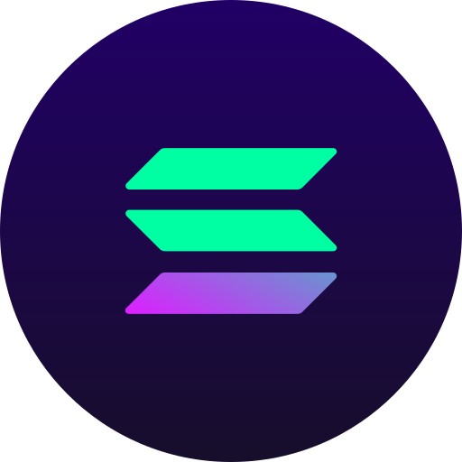
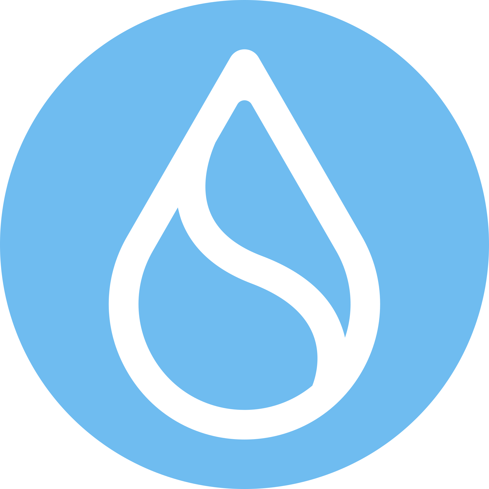
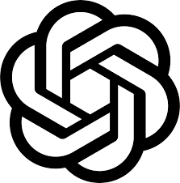

  
AI & Blockchain Developer helping startups and businesses build scalable, high-performance products.

I specialize in AI automation, AI trading bots, blockchain development, smart contracts, Web3 applications, and casino/gaming platforms.
 From backend infrastructure to full product development, I focus on building secure, efficient, and production-ready solutions.

I’m open to collaborations, freelance projects, and long-term partnerships.

   

<!--chiziqni kodi-->

<table align="center">
<!-- skill -->
  <tr>
    <td align="center" width="90">
      
       Javascript
    </td>
    <td align="center" width="90">
      
       Typescript
    </td>
    <td align="center" width="90">
      
       Rust
    </td>
     <td align="center" width="90">
      
       Solidity
    </td>
    <td align="center" width="90">
      
       Python
    </td>
    <td align="center" width="90">
      
       C++
    </td>
    <td align="center" width="90">
      
       GoLang
    </td>
    <td align="center" width="90">
      
       PHP
    </td>
    <td align="center" width="90">
      
       Ruby
    </td>
    <td align="center" width="90">
      
       java
    </td>
  </tr>
  <!-- network -->
<tr>
  <td align="center" width="90">
    
     Solana
  </td>
  <td align="center" width="90">
    
     Ethereum
  </td>
  <td align="center" width="90">
    
     Bitcoin
  </td>
  <td align="center" width="90">
    
     Aptos
  </td>
  <td align="center" width="90">
    
     Polkadot
  </td>
  <td align="center" width="90">
    
     Cosmos
  </td>
  <td align="center" width="90">
    
     Polygon
  </td>
  <td align="center" width="90">
    
     Ton
  </td>
  <td align="center" width="90">
    
     Tron
  </td>
  <td align="center" width="90">
    
     Sui
  </td>
</tr>
<tr>
    <td align="center" width="90">
      
       Nodejs
    </td>
    <td align="center" width="90">
      
       Express
    </td>
    <td align="center" width="90">
      
       React
    </td>
    <td align="center" width="90">
      
       Next.js
    </td>
    <td align="center" width="90">
      
       Django
    </td>
    <td align="center" width="90">
      
       Laravel
    </td>
    <td align="center" width="90">
      
       Angular
    </td>
    <td align="center" width="90">
      
       PostgreSQL
    </td>
    <td align="center" width="90">
      
       MongoDB
    </td>
    <td align="center" width="90">
      
       MySQL
    </td>
  </tr>
<!-- common -->
  <tr>
    <td align="center" width="90">
      
       OpenAI
    </td>
    <td align="center" width="90">
      
       DeepSeek
    </td>
    <td align="center" width="90">
      
       LangChain
    </td>
    <td align="center" width="90">
      
       Hugging Face
    </td>
    <td align="center" width="90">
      
       ElizaOS
    </td>
    <td align="center" width="90">
      
       TensorFlow
    </td>
    <td align="center" width="90">
      
       PyTorch
    </td>
    <td align="center" width="90">
      
       Ollama
    </td>
    <td align="center" width="90">
      
       FastAPI
    </td>
    <td align="center" width="90">
      
       VApi
    </td>
  </tr>
  
</table>

